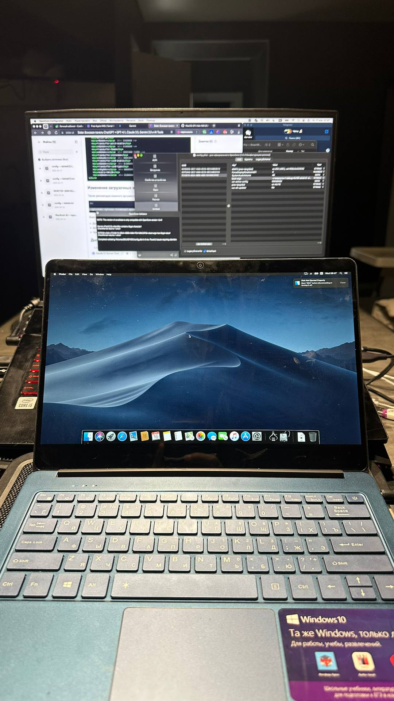

# MacOS-EFI-irbis-NB125  test mode

EFI загрузчик для Mac OS Hackintosh на ноутбук Irbis NB125.  
⛔Сырой EFI для успешной загрузки macOS на ноутбуке Irbis NB125. Пока в режиме настройки!!!⛔  

  

## Руководство по установке  
Рекомендуется использовать официальное руководство OpenCore:  
https://dortania.github.io/OpenCore-Install-Guide/  

## Конфигурация железа  

| Компонент              | Характеристики                                     |  
|-----------------------|--------------------------------------------------|  
| Модель компьютера      | Irbis NB125 (12.5" FHD/IPS)                       |  
| Процессор             | Intel Celeron N3350 @ 1.10GHz (Apollo Lake)       |  
| Ядер / потоков          | 2 ядра / 2 потока                                 |  
| Память RAM             | 3 GB DDR3 (две планки по 1.5 ГБ, 1600 MHz)         |  
| Хранение данных        | SSD 32 GB                                         |  
| Видеокарта (iGPU)      | Intel UHD Graphics 500 (Apollo Lake)              |  
| Сетевая карта Ethernet | Realtek RTL8168H                                   |  
| Аудио                  | Realtek ALC233                                    |  
| Wi-Fi                  | Intel Wi-Fi 6 AX201                               |  
| Дисплей                | 12.5" IPS FHD 1920x1080                           |  

## Настройки BIOS  

- Включить показ скрытых настроек: CTRL Right + SHIFT Right + ALT Left + F2  
- Отключить Secure Boot (в Security)  
- Отключить CFG Lock (Advanced -> Power & Performance -> CPU -> CPU Lock Configuration)  
- Отключить Fast Boot (Boot)  
- Выбрать режим загрузки UEFI без CSM (Boot)  

## Что работает  
   
- Корректная перезагрузка, переход в спящий режим и выключение    
- Все USB порты корректно распознаются   
- Функциональные клавиши (яркость, громкость и др.)   

## Что не работает  

- Управление питанием процессора (P-States, C-States)  
- AirDrop пока не поддерживается  
- QE/CI графика Intel UHD Graphics (аппаратное ускорение iGPU)
- Аудио Realtek ALC233
- Трекпад с поддержкой мультитач-жестов  
- Индикация состояния батареи 
- Wi-Fi Intel AX201  
- Аудио Realtek ALC233 
- Bluetooth  
- Поддержка Bluetooth-гарнитуры и микрофона  
- Вывод видео и аудио через HDMI 
- iMessage и FaceTime работают  
---  

Этот проект распространяется по лицензии [MIT](LICENSE).
Copyright (c) 2025 SmartMaster35rus
